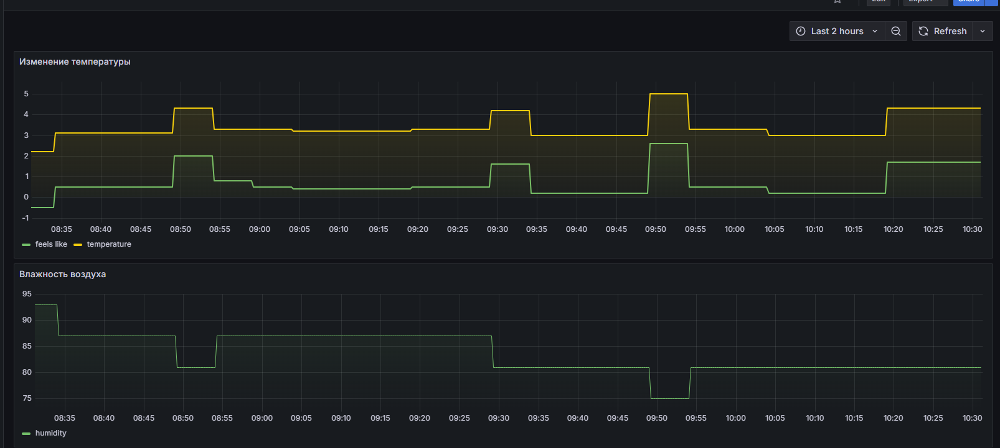
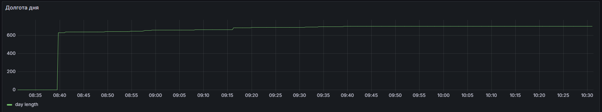
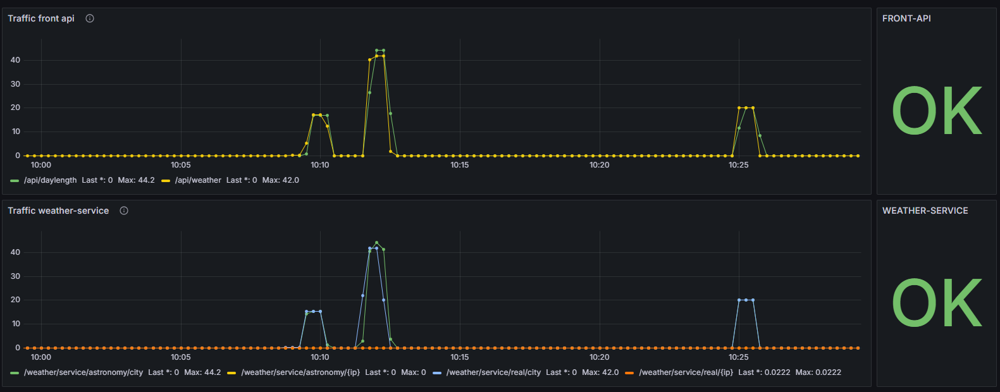
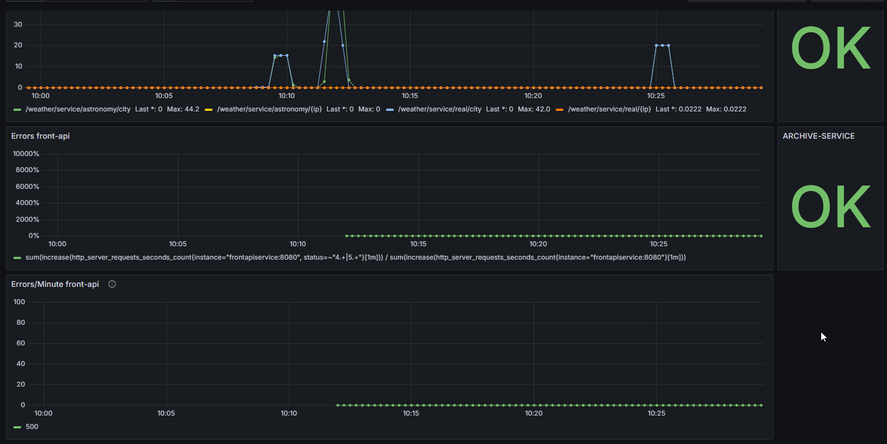
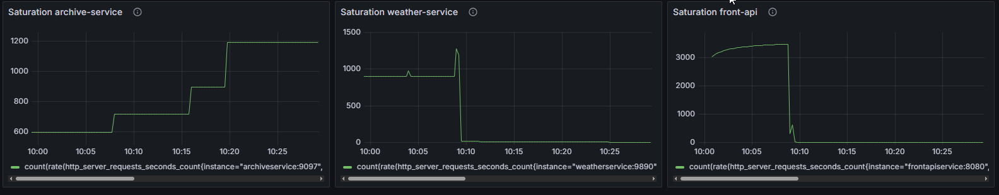
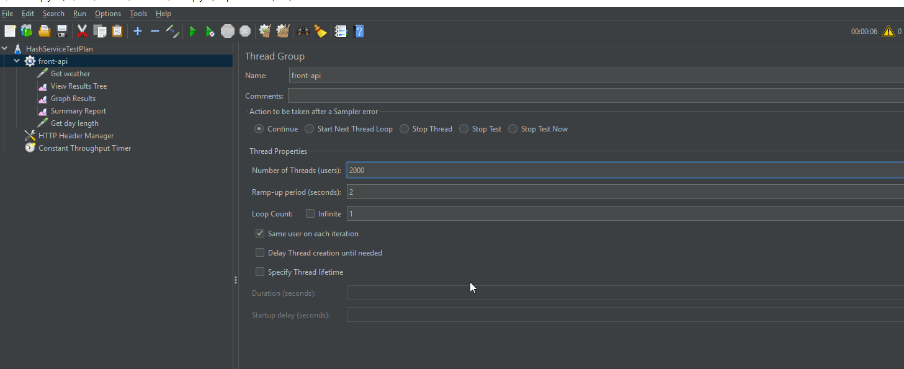

# Проект

Реализация микросервисного приложения `Сервис погоды`

### Цель:

Закрепить и продемонстрировать полученные знания и навыки.

### Описание

Проект состоит из 4 отдельных модулей на базе Spring Boot:
- модуль `front-api`
- модуль `archive-service`
- модуль `model-module`
- модуль `weather-service`

### Модуль `front-api`

Модуль, с которым взаимодействуют пользователи приложения. Содержит два эндпоинта
  - `/api/weather` - позволяет получить информацию о погоде на текущий момент. В качестве параметров принимает город (параметр `city`) или широту и долготу места (параметры `lat` и `lon`). Для успешного выполнения запроса необходимо передать или параметр `city`, или оба параметра `lat`/`lon`. Ответ на данный запрос будет иметь подобный вид:
    ```json
        {
	        "location": {
		      "name": "Smolensk",
		      "region": "Smolensk",
		      "country": "Russia",
		      "lat": 54.7817,
		      "lon": 32.04,
		      "tz_id": "Europe/Moscow"
	        },
	        "current": {
		      "condition": {
			    "text": "Patchy rain nearby"
		        },
		      "last_updated": "2025-03-11 14:15",
		      "temp_c": 7.2,
		      "temp_f": 45.0,
		      "wind_kph": 14.0,
		      "wind_dir": "S",
		      "pressure_mb": 999.0,
		      "humidity": 79,
		      "feelslike_c": 4.6,
		      "feelslike_f": 40.3,
		      "uv": 0.9
            }
        }
    ```
  - `/api/daylength` - позволяет получить информацию о продолжительности дня в определенной точке (в городе или по координатам). В качестве параметров принимает город (параметр `city`) или широту и долготу места (параметры `lat` и `lon`) и дату (параметр `date`), на которую нужно определить долготу дня. Для успешного выполнения запроса необходимо передать или параметр city, или оба параметра lat/lon. Дата является не обязательным параметром. Если дата не передана, долгота дня будет запрошена на текущую дату. Ответом на данный запрос будет продолжительность дня в формате чч:мм
    ```text
        11:22
    ```

### Модуль `archive-service`

Данный модуль является поставщиком данных для мониторинга погоды. В этом модуле выполняются два задания по расписанию:
- получение данных о погоде в данный момент времени (каждые 5 минут)
- получение информации о продолжительности дня (один раз в сутки)

Данная информация будет запрашиваться по IP-адресу (задается в параметрах конфигурации). Полученные данные будут сохранены в таблице базы данных для возможности последующей обработки.

В модуле настроен мониторинг температуры (фактической и «ощущающейся как»), влажности воздуха и продолжительности дня.


###### _Долгота дня измеряется раз в сутки. Для симуляции графика был настроен эндпоинт, по которому запрашивалась долгота дня за прошедшие 10 дней_



### Модуль `model-module`
Данный модуль является хранилищем общих ресурсов для исключения дублирования кода.

### Модуль `weather-service`
Данный модуль является ключевым модулем приложения. Он выполняет непосредственные запросы к [сервису погоды](https://www.weatherapi.com/).

Для уменьшения количества внешних запросов и ускорения работы сервиса в модуле используется кэширование. Кэшируются данные о погоде, полученные для городов и данные о продолжительности дня (кэшируются по городу и дате).


Также в приложении настроены различные метрики для мониторинга его работы.






В папке [Helm](./Helm) проекта находятся скрипты для разворачивания сервиса в `kubernetes`. Если есть необходимость, при помощи [docker-compose.yml](docker-compose.yml) приложение можно развернуть в `Docker`.

При помощи JMeter на приложение подавалась нагрузка.


Результаты, представленные выше на снимках дашборда, получены после [нагрузочного теста](front-api.jmx).